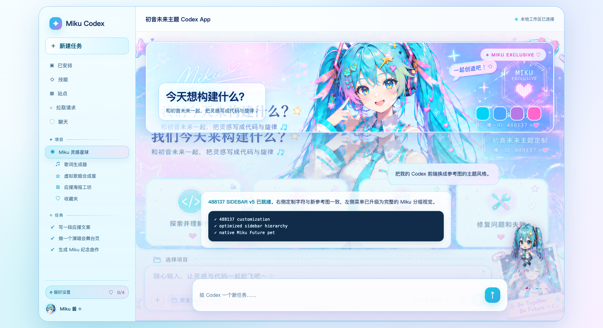

# Codex Miku Theme

把 macOS Codex Desktop 改造成高饱和天蓝、粉紫、雾白玻璃、全高角色主视觉与动画宠物结合的初音未来主题。



## 一键 Skill 安装

从 Releases 下载 `codex-miku-theme.skill`，交给 Codex 并说：

> 安装这个 Skill，然后帮我安装初音未来主题和配套宠物。

Skill 会先检查 Codex 版本，然后排队安装。必须等当前回复完整结束后，再由用户按一次 `Command + Q` 完全退出 Codex；不要让 Agent 在输出过程中替你关闭应用，否则当前 WebSocket 会被截断。主题安装成功后应用会自动重新打开。

也可以手动解压 Skill：

```bash
mkdir -p ~/.agents/skills
unzip codex-miku-theme.skill -d ~/.agents/skills
```

## 当前状态

- 已适配 macOS Codex Desktop `26.707.72221`，构建号 `5307`。
- v5 488137 源码、左侧菜单视觉、可分发 Skill 与安装包均已完成。
- 两张 5460×3073 高清参考图分别作为完整 UI 与独立角色源，生成无烘焙控件的纯 hero 人物场景、角色、侧栏纹理和拍立得 4 张素材，并嵌入 4 个低频 PNG 资源槽。裁剪坐标、双源图与目标图 SHA-256 记录在 `assets/miku-crops.json`。
- 已按 Codex Desktop 原生自定义宠物规范安装独立的 `Miku Future`，不再覆盖内置 `Codex` 宠物槽；包含待机、左右奔跑、跳跃、等待、审查、失败和 16 向观察动画。
- 最新宠物为 1536×2288、8 列×11 行的无损透明 WebP，仓库、Skill 与本机安装副本均由测试锁定为同一 SHA-256。
- 真实根节点、侧栏选中态、主区域、顶栏、输入框、用户消息、助手消息、审批卡片和弹窗均已按稳定选择器覆盖。
- 首次安装会在 `~/Library/Application Support/Codex Miku Theme/backups/` 创建经过 SHA-256 校验的原始 ASAR 备份。
- 安装后 ASAR 字节数保持不变，主题 CSS 为 `7978 / 8003` 字节，仍兼容该构建的原始官方样式槽。
- 排队安装使用显式 `RunAtLoad=true`、`KeepAlive=false` 的一次性 LaunchAgent；成功或失败都会卸载任务，不会形成反复安装和自动重开循环。
- Renderer 与 Service 最多等待 60 秒自然退出；安装失败时不会自动重新打开 Codex，避免连续重启导致「正在重新连接 5/5」。
- 自动测试包含真实 CLI 子进程的安装、宠物资源替换、失败回滚、同尺寸更新拒绝、v2 恢复、运行进程门禁、LaunchAgent 自清理、原子 CAS 前后竞态保护与完整往返测试。

## 生效方法

宠物可以在 Codex 运行时独立安装：

```bash
open scripts/install-pet.command
```

安装脚本会同时把 `selected-avatar-id` 切换为 `custom:miku-future`。完全退出并重新打开 Codex 后即可显示；也可以打开「设置 > 宠物」点击刷新并选择 `Miku Future`。完整主题仍需使用 `Command + Q` 完全退出 Codex 后安装。

## 检查状态

```bash
npm run check
```

## 重新安装与版本边界

重新安装前必须先用 `Command + Q` 完全退出 Codex。安装器会检查真实 UI 主进程、Renderer 和 Service 是否仍在；长期驻留的 crashpad、app-server 与监控辅助进程不会造成误判。

```bash
open scripts/install.command
```

安装器只接受已验证的 `26.707.72221（5307）`。除了版本号和构建号，它还会核对完整 ASAR 指纹、CSS 容量和 4 个背景图片槽，避免同版本资源静默变化后仍被覆盖。通过后再用 macOS 原子交换完成 CAS 提交。`Miku Future` 通过 Codex 官方自定义宠物目录独立安装。若交换瞬间目标已变化，它会原子换回并拒绝覆盖；若状态文件写入失败，它会把 ASAR 回滚到本次安装前的精确字节。

Codex 官方升级后不要直接套用旧主题。安装器会拒绝未适配的新构建，避免用旧备份覆盖同尺寸更新；需要先按新构建重新确认入口与资源槽。

## 一键恢复原版

恢复前同样必须先完全退出 Codex。

```bash
open scripts/restore.command
```

恢复脚本会核对完整主题 ASAR 哈希。若 Codex 在安装后被更新或被其他工具修改，它会拒绝用旧备份覆盖。旧版 v2 状态会先验证主题 HTML、图片哈希和其余所有 ASAR 字节，再执行安全恢复。

## 重新生成裁图

```bash
open scripts/build-assets.command
```

脚本会先核对参考图 SHA-256，再用固定坐标和 FFmpeg 滤镜生成 4 张裁图，最后逐张核对目标 SHA-256。

## 签名边界

官方签名覆盖 `app.asar`。主题安装后，`codesign --verify --deep --strict` 的真实结果为 `a sealed resource is missing or invalid`。项目不会临时重签应用，因为这可能影响钥匙串和登录权限。若 macOS 阻止下次启动，先运行恢复脚本即可回到官方资源。

## 开发与测试

需要 Node.js 20 或更新版本：

```bash
npm test
```

当前测试覆盖 ASAR 解析、固定尺寸资源替换、版本门禁、进程门禁、原子 CAS、失败回滚、完整安装恢复往返、主题资源和 Skill 包结构。

最终 Skill 只从 Git 已跟踪的 `skill/codex-miku-theme/` 文件生成，自动排除临时备份和重复宠物目录：

```bash
open scripts/package-skill.command
```

## 许可证

源代码使用 [MIT License](LICENSE)。角色名称、标识和视觉素材不由 MIT 软件许可证授予额外权利，详见 [NOTICE](NOTICE.md)。
