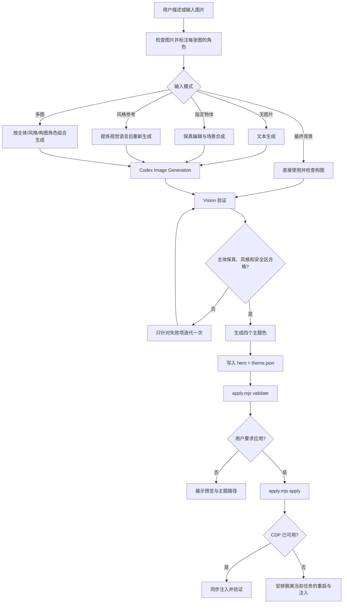

# ChatGPT Desktop Skin Skill 商业 MVP 方案

> 状态：建议实施稿
> 研究基线：`HeiGeAi/heige-codex-skin-studio` `main@7beba21`
> 研究日期：2026-07-16
> 目标平台：macOS ChatGPT Desktop

> 命名说明：当前产品名为 ChatGPT Desktop，技术 bundle ID 仍为 `com.openai.codex`。`/Applications/ChatGPT.app` 是规范路径，`/Applications/Codex.app` 仅作为旧命名兼容路径保留。

## 1. 结论

第一阶段应定义为：

> 一个“Codex 皮肤设计 Agent + 单文件确定性应用器”。

推荐架构是：

```text
Codex Skill
  -> 理解用户意图
  -> 使用 Codex Vision / Image Generation 生成并检查主图
  -> 生成极简 theme.json
  -> 调用 scripts/apply.mjs
  -> 通过回环 CDP 向 Codex renderer 注入一个幂等 style 标签
```

不建设网站、数据库、主题生成服务、常驻 Runtime、Marketplace、支付、用户系统或独立图片处理服务。

但需要修正一个预期：`apply.mjs` 可以是“一个入口文件”，不宜把“300 行以内”设为硬验收标准。上游经过测试的 CDP 客户端单独已有 539 行，覆盖回环地址校验、renderer 发现、超时、WebSocket 生命周期、命令关联和异常传播。商业 MVP 更合理的目标是：

- 单文件、零 npm 依赖；
- 分发代码控制在约 650-800 行；
- 压缩后不含示例图片时小于 100 KB；
- 关键失败路径有测试；
- 不修改 Codex 应用包和签名。

如果强行压到约 300 行，通常会删掉超时、错误处理、路径校验或 CDP 安全限制，不适合作为可公开分发的 MVP。

## 2. 上游研究结论

### 2.1 直接证据

| 结论 | 仓库证据 | 可信度 |
| --- | --- | --- |
| CDP 注入路线已经可行，且不需要修改 `app.asar` | `README.md:21-31`；`scripts/lib/launch-codex.zsh:19-21`；`src/injector.mjs:65-100` | 高 |
| ChatGPT Desktop 应用在当前 macOS 安装中位于 `/Applications/ChatGPT.app`，bundle id 是 `com.openai.codex` | `src/constants.mjs:10`；`src/cli.mjs:88-92`；本机 `Info.plist` 与签名检查 | 高 |
| 一张本地图片加四个颜色已经能驱动通用皮肤 | `src/theme-store.mjs:17-59`；`src/skin-css.mjs:20-58` | 高 |
| 当前实现已限制 CDP 到 `127.0.0.1`，并拒绝非回环 WebSocket | `src/cdp-client.mjs:31-59`、`177-238`、`290-305` | 高 |
| 主题加载已防御绝对路径、`..` 和逃逸符号链接 | `src/theme-schema.mjs:40-53`、`118-143` | 高 |
| 当前 `.skill` 已经不是轻量 Skill，而是完整产品分发包 | `scripts/package-skill.command:10-18` 打包源码、9 个主题和桌宠；实测归档约 8.47 MB | 高 |
| 当前注入在 renderer 完整重载后消失，需要重新 apply | `README.md:59`、`123-127`；`skill/heige-codex-skin-studio/SKILL.md:78-83` | 高 |
| 当前应用器还承担主题菜单、浏览器内上传、取色和本地存储 | `src/skin-menu.mjs:41-254` | 高 |
| 上游已从 ASAR 修改迁移到 CDP，旧方案存在签名与更新兼容风险 | tag `v5-asar-legacy`；旧设计文档；`README.md:127` | 高 |
| 现有非打包测试 46 项全部通过 | 本次运行 `node --test`，排除会重写归档的 `skill-package.test.mjs` | 高 |
| Codex 内置 Node 可直接提供 `fetch` 和 `WebSocket`，无需 npm 依赖 | 本机内置 Node `v24.14.0`，两者均为全局函数 | 高 |

### 2.2 推论

1. 最值得复用的是 `cdp-client` 的安全与错误处理思想、`injector` 的幂等注入、`theme-schema` 的路径防御和 `skin-css` 的通用 CSS。
2. 第一阶段不应复用 `skin-menu`、桌宠、九套预设、主题商店、GUI 自定义上传和自动取色代码。这些模块不属于“设计 Agent + 应用器”核心。
3. `.skill` 不应复制一份完整运行时到 `~/.codex/heige-codex-skin-studio`。Skill 内的 `apply.mjs` 可以直接运行，生成的主题放到用户数据目录即可。
4. “Codex 负责创意，脚本负责确定性和安全”是最合理的边界：图像构图、风格和配色交给模型；路径验证、对比度检查、应用发现、进程重启和 CDP 协议交给脚本。

### 2.3 当前证据无法保证的事项

- ChatGPT Desktop 后续版本是否继续接受 `--remote-debugging-port`。
- 官方 DOM 类名和属性长期稳定性。
- Windows/Linux 的应用路径、进程模型和 CDP 启动参数。
- 图片生成工具在所有 Codex 客户端版本中的本地文件交付方式。

因此 P0 只承诺当前 macOS 版本，并要求 `doctor`、注入后验证和明确失败信息。

## 3. 第一阶段目标与非目标

### 3.1 目标

1. 用户提供描述、最终背景图、物体来源图、风格参考图或多张组合参考图后，Codex 能创建一个可复用主题目录。
2. 主题只需要一张主图和一个 `theme.json`。
3. Skill 使用 Codex 自带 Image Generation，不要求用户配置额外 API Key。
4. 指定物体模式默认尽量保持原物体、人物身份或产品结构一致，只重构背景、光线和横向构图。
5. 风格参考模式只提取视觉语言，不默认复制原图主体、文字和构图。
6. 应用器零 npm 依赖，不修改 `app.asar`，不破坏代码签名。
7. 已用 CDP 启动时同步应用；未启用 CDP 时，安全安排一次重启后应用。
8. 支持 `doctor`、`validate`、`apply`、`status`、`restore`。
9. 所有命令返回稳定 JSON，便于 Skill 判断成功、失败或“已安排重启”。
10. 使用一个确定性 `create-theme.mjs` 完成 `hero`、可选资源和 `theme.json` 的一次性生成与校验。
11. 提供显式启用的 macOS LaunchAgent 持久模式，在 renderer 重启后自动重新注入当前主题。
12. 最终分发的 Skill、脚本、模板、示例、代码注释、日志和诊断信息全部使用英文。

### 3.2 非目标

- 不做网站、账号、数据库、云端生成、支付和 Marketplace。
- 不默认安装常驻 helper 或 LaunchAgent；持久模式必须由用户显式启用并可卸载。
- 不做 Codex 内主题切换菜单。
- 不做浏览器端图片上传和自动取色算法。
- 不默认建设独立抠图服务或保存透明中间资产；优先让 Image Generation 直接完成物体保真编辑与场景合成。
- 不做多层素材、组件皮肤、Logo 替换、拍立得挂件或桌宠。
- 不修改应用包、签名、ASAR 或官方业务 JavaScript。
- 不承诺 Windows/Linux。
- 不在 Skill 包内分发 Miku、游戏角色或其他第三方 IP 预设。

## 4. 最小目录

```text
codex-skin-studio/
├── SKILL.md
├── agents/
│   └── openai.yaml
├── scripts/
│   ├── apply.mjs
│   ├── create-theme.mjs
│   └── persist.mjs
├── templates/
│   └── theme.json
└── examples/
    └── cyberpunk/
        ├── prompt.md
        └── theme.json
```

说明：

- `agents/openai.yaml` 是 Codex Skill 推荐的 UI 元数据，不是 Runtime。
- 不添加 Skill 自己的 `README.md`、安装指南或变更日志；这些不是 Agent 执行所需资源。
- 示例不携带大图，只提供 Prompt 和 manifest 示例，避免包体积与版权问题。
- 分发目录内的 `SKILL.md`、`agents/openai.yaml`、`apply.mjs`、`create-theme.mjs`、`persist.mjs`、模板和示例必须全英文；变量名、注释、错误码、错误消息和 JSON 字段也使用英文。
- Codex 可以按用户语言回复，用户生成的 `theme.name` 也可以保留原语言；这两项不属于 Skill 源码语言约束。
- 用户生成的主题不写回 Skill 目录，统一保存到：

```text
~/Library/Application Support/CodexSkinStudio/
├── themes/<theme-id>/
│   ├── hero.png|jpg|webp
│   └── theme.json
└── state.json
```

这不是独立 Runtime，只是用户资产和最近一次应用状态。

## 5. 端到端工作流

### 5.1 意图分流

| 用户表达 | 默认行为 |
| --- | --- |
| “设计/生成一个皮肤” | 生成图片和主题，展示结果，不主动重启 Codex |
| “生成并应用/现在换上” | 生成、验证、保存，然后应用；必要时安排一次重启 |
| “直接用这张图做皮肤” | 把图片视为最终背景，检查构图后生成主题 |
| “提取图里的这个人物/产品/物体做皮肤” | 把图片视为编辑目标，尽量保持指定主体一致，重构背景与安全区 |
| “参考这张图的风格做皮肤” | 把图片视为风格参考，重新生成符合 Codex 布局的新画面 |
| “用图 1 的人物，图 2 的风格” | 显式标注每张图角色，执行多图合成生成 |
| “恢复原版/关闭皮肤” | 移除注入；用户要求关闭调试端口时正常重启应用 |
| “当前是什么皮肤” | 调用 `status` |

用户已明确要求“应用”时不重复询问。用户只说“生成”时，不应擅自重启当前 Codex 任务。

### 5.2 主流程



### 5.2.1 五区构图契约

每次生成 hero 都必须在 Prompt 和 Vision 验收中同时确认以下空间，不得只检查人物是否好看：

- 左侧：品牌 Logo 或品牌名、专属导航系统的安全区；不放人物脸部、主体高光或密集细节。
- 中部：沉浸式背景和对话内容可读的渐变安全层空间。
- 右侧：人物或产品主体，以及可选品牌信息卡的留白空间。
- 底部：约 20% 的低对比度专属输入工作台安全区。
- 右下：可选肖像卡的次要区域，不覆盖主体、输入框或主要品牌信息。

Hero 只提供场景、氛围、主体和留白，不绘制真实 UI、菜单、按钮、聊天内容、品牌文字或水印。真实导航、渐变层、输入工作台和可选卡片由注入器提供。

### 5.3 图生皮肤策略

图生皮肤不是 `apply.mjs` 的职责。`apply.mjs` 只负责主题文件校验、持久化、ChatGPT Desktop 发现和 CDP 注入；图片生成必须由 Codex Agent 编排 Codex 的原生 `image_gen` 工具完成。

Skill 的执行契约如下：

1. Skill 先调用 `$imagegen`，并使用原生 `image_gen`，不能只在提示中提到 imagegen 后继续执行。
2. 本地图片先用 Vision 的 `view_image` 检查，再将绝对路径作为原生工具的参考输入；仅存在于当前会话的附件使用会话图片输入。
3. 生图工具返回结果前，不得创建 `hero`、`theme.json`，也不得运行 `apply.mjs`。
4. 生图返回 `404 Not Found` 时，只允许检查输入文件并进行一次纠正重试；若当前会话没有可用图片，则要求用户重新附加图片或提供最终本地背景，不切换到外部 API/CLI。
5. 只有拿到真实的本地输出路径并完成 Vision 检查后，才可以复制到主题目录并进入 validate/apply。

2026-07-17 的环境验证记录：原生 `image_gen` 在无参考图的普通生成请求中也返回 `404 Not Found`；使用 Xellos 附件的绝对路径同样返回 404；使用会话图片输入时报告当前会话可用图片数量为 0。进一步检查发现当前 Codex 使用 `custom` provider，`base_url` 为 `http://127.0.0.1:15721/v1`，`wire_api` 为 `responses`；该中转的 `/v1/models` 返回空模型列表，`/v1/images/generations` 直接返回 `404`。因此本次无法生成皮肤的直接阻塞是中转站未提供兼容的生图路由，另有会话图片上下文缺失；问题不在主题 schema、CDP 注入或 `apply.mjs`。MVP 保留本地最终背景作为人工兜底，不引入 API key 或外部图片服务。

评估过三种实现方式：

| 方式 | 优点 | 缺点 | P0 决策 |
| --- | --- | --- | --- |
| 直接编辑/合成 | 一次生成完成主体保留、扩图、换背景和安全区构图；步骤少，身份漂移较小 | 不产生可复用透明物体 | 指定物体默认路径 |
| 先透明抠图再合成 | 中间资产可复用，构图控制更强 | 多一次处理，复杂边缘困难，增加 Pipeline 和身份漂移 | 仅用户明确要求透明资产时启用 |
| 仅做风格重生成 | 速度快、自由度高，适合参考图 | 无法保证指定人物或产品一致 | 仅 `style-reference` 路径 |

最终采用混合路由：指定物体优先直接编辑/合成；风格参考重新生成；透明抠图是显式需求的可选支路。这样既支持图生皮肤，也不把 P0 扩展成独立图片处理系统。

### 5.4 重启交互

首次应用无法在一个未开启 CDP 的 Electron 进程里动态打开调试端口，因此必须处理重启。

推荐行为：

1. 先完成图片、主题文件、验证和持久化。
2. `apply.mjs` 检查 `127.0.0.1:<port>/json/list`。
3. 若 CDP 已存在，当前进程同步注入并返回成功。
4. 若 CDP 不存在，主进程启动同一 `apply.mjs` 的 detached worker，输出 `scheduled` JSON 后立即退出。
5. detached worker 延迟数秒，正常退出 bundle id `com.openai.codex`，以回环 CDP 参数重新打开，等待 renderer，注入并写入 `state.json`。

这样不需要常驻 Helper，也能让 Skill 在 Codex 被关闭前尽量完成当前回复。仍应在执行前明确提示“应用会重启 Codex，当前任务界面会短暂关闭”。

## 6. SKILL.md 建议稿

````markdown
---
name: codex-skin-studio
description: Design, generate, validate, apply, inspect, or remove single-image skins for ChatGPT Desktop on macOS. Supports text-to-image generation, direct background images, subject-preserving image composition, style-reference generation, and multi-image composition. Use when the user asks to reskin ChatGPT Desktop, create a desktop theme or background, preserve a person, product, or object from an image, derive a skin from a style reference, apply a generated workspace, inspect the active skin, or restore the native interface.
---

# Codex Skin Studio

Let Codex handle visual decisions. Delegate file validation, application discovery, restart orchestration, and CDP injection to `scripts/apply.mjs`.

## Operating rules

- Keep the runtime theme single-image. Do not create layers, component packs, websites, or an additional runtime.
- Never modify `app.asar`, the application bundle, the code signature, or official JavaScript.
- Target ChatGPT Desktop on macOS. Its current technical bundle identifier is `com.openai.codex`.
- Generate without restarting when the user asks only for a design. Complete the apply flow when the user explicitly asks to apply it.
- Use the built-in `imagegen` skill by default. If image generation is unavailable, ask for a final local background image. Do not request an API key or switch to an external image service automatically.
- Assign every input image exactly one primary role: final background, edit target, subject source, style reference, or composition reference.
- For a specified subject, preserve identity, silhouette, proportions, materials, clothing, defining details, or product geometry. Change only the environment, lighting, and canvas composition.
- For a style reference, carry over visual traits such as color, materials, lighting, rendering, and mood. Do not copy the original subject or composition by default.
- Do not generate or bake in buttons, menus, chat text, watermarks, or shortcut instructions. Preserve a source logo only when the user explicitly requests it and confirms the right to use it.
- Write every distributed Skill artifact, script comment, diagnostic, log message, example, and template in English. Respond to the user in the user's language.

## Runtime discovery

Treat the directory containing this `SKILL.md` as `SKILL_ROOT`. Prefer the current `node` executable. If it is unavailable, use the Node executable bundled with Codex. Run:

```bash
node "$SKILL_ROOT/scripts/apply.mjs" doctor --json
```

If `node` is unavailable, try:

```bash
"/Applications/ChatGPT.app/Contents/Resources/cua_node/bin/node" \
  "$SKILL_ROOT/scripts/apply.mjs" doctor --json
```

## Classify input images

1. Inspect every local image with `view_image` so it is available in the current visual context.
2. Assign one role from the user's wording:
   - `final-background`: use the image itself as the final background.
   - `edit-target`: preserve the specified subject and rebuild the rest of the image.
   - `subject-source`: place a person, product, or object from the image into a new scene.
   - `style-reference`: derive visual style only.
   - `composition-reference`: derive camera or layout relationships only.
3. Do not ask again when the user already specified the role. If it is unclear whether to preserve the subject or use only the style, ask only that question.
4. Reject empty files and formats other than PNG, JPEG, or WebP.

## Use a final background directly

1. Treat the input as `final-background` and skip Image Generation.
2. Check aspect ratio, safe zones, text, watermarks, and interface readability.
3. Explain any failure. Switch to edit mode only when the user allows image modification.
4. Save an accepted image as the final `hero.<ext>`.

## Preserve a specified subject

1. Mark the source image as `edit-target` or `subject-source`.
2. Use the built-in `imagegen` edit or composition flow directly. Do not create a transparent cutout first. Preserve the specified subject, extend or rebuild the environment, and create a new 16:9 image with Codex-safe regions.
3. Repeat the required invariants in the prompt: identity, face, silhouette, proportions, clothing, colors, materials, source logo, or product geometry.
4. Allow changes only to the background, environment, lighting, shadows, framing space, and subject placement.
5. Create a reusable transparent subject only when the user explicitly requests one. Start with the built-in chroma-key workflow. For hair, glass, smoke, translucent materials, or other complex edges that require native transparency, explain the CLI fallback and API-key requirement, then wait for approval before switching.
6. Compare the source and result with Vision. If identity or product structure drifts, retry once with only the failed invariant strengthened.

## Use a style reference

1. Mark the image as `style-reference` and use generation, not source-image editing.
2. Extract style traits: primary and secondary colors, contrast, materials, brushwork or rendering, lighting, density, mood, and period.
3. Create a new scene and composition. Do not copy people, characters, text, logos, trademarks, or the reference's unique arrangement unless the user explicitly requests it and confirms the right to use it.
4. Combine the extracted style traits with the Codex safe-zone constraints in the `imagegen` prompt.
5. Verify that the result carries the requested style while remaining a newly composed skin image.

## Combine multiple images

1. Declare each numbered input, for example: `Image 1: subject-source`, `Image 2: style-reference`, and `Image 3: composition-reference`.
2. State what each image may contribute and what must remain unchanged. Do not assign ambiguous or conflicting roles.
3. Prioritize subject fidelity over style matching, and safe zones over the reference composition.
4. Validate subject fidelity, style, and layout separately. Do not replace the individual checks with a single subjective judgment.

## Generate from a text description

1. Create a visual brief covering theme, mood, palette, subject placement, safe zones, and prohibited content.
2. Use the available `imagegen` skill to generate a landscape hero image.
3. Use Vision to verify readability for the left navigation, center conversation area, and bottom composer. Keep people and high-contrast subjects on the right.
4. If the result fails, make one targeted regeneration. Do not iterate without a bound.

## Create the theme files

1. Create a theme directory and save the selected image as `hero.<ext>`. Do not reference only the cached file under `$CODEX_HOME/generated_images`.
2. Derive six-digit hexadecimal values for `accent`, `secondary`, `surface`, and `text` from the final hero image.
3. Write `theme.json`.
4. Do not copy original inputs, transparent intermediates, or reference images into the theme directory unless the user asks to retain source assets.

## Validate the theme

```bash
node "$SKILL_ROOT/scripts/apply.mjs" validate "/absolute/path/to/theme" --json
```

Fix validation failures and retry. Never bypass validation.

## Apply the theme

Run only when the user explicitly asks to apply the theme:

```bash
node "$SKILL_ROOT/scripts/apply.mjs" apply "/absolute/path/to/theme" --json
```

- `applied`: injection completed and verification passed.
- `scheduled`: the theme was persisted and a restart-time injection was scheduled. Immediately report the theme path, theme id, and restart behavior.
- `failed`: read the error code, fix a recoverable problem, and retry once.

## Inspect or restore

```bash
node "$SKILL_ROOT/scripts/apply.mjs" status --json
node "$SKILL_ROOT/scripts/apply.mjs" restore --json
```

When the user also asks to close the debugging port:

```bash
node "$SKILL_ROOT/scripts/apply.mjs" restore --restart-normal --json
```

## Completion criteria

- The theme directory contains a non-empty hero image and a valid `theme.json`.
- `validate` succeeds.
- When application was requested, the result is `applied` or explicitly `scheduled`. Never report generated files as an active skin.
- Report the final theme id, theme directory, and application status.
````

## 7. 图片设计契约

### 7.1 输入图片角色契约

每张图片只能有一个主要角色，避免模型自行猜测：

| 角色 | Image Generation 模式 | 必须保留 | 允许改变 |
| --- | --- | --- | --- |
| `final-background` | 不生成 | 原图像素与内容 | 只允许用户明确要求的裁切或压缩 |
| `edit-target` | 编辑 | 用户指定主体及保真不变量 | 背景、环境、光线、画幅和留白 |
| `subject-source` | 编辑/合成 | 指定人物、产品或物体 | 新场景中的位置、光线和合理透视 |
| `style-reference` | 生成 | 色彩、材质、光线、笔触、氛围等风格特征 | 场景、主体和构图必须重新设计 |
| `composition-reference` | 生成 | 镜头关系和空间组织 | 具体主体、颜色和细节 |

默认优先级：

```text
用户明确的不变量 > 主体身份/产品结构 > Codex 安全区 > 风格匹配 > 构图参考
```

“提取物体”默认指生成新的皮肤成图，不代表必须输出透明 PNG。只有用户要求独立复用物体时才增加透明抠图步骤。

### 7.2 构图规范

不要把皮肤图当成完整 UI Mockup。它是实际 Codex UI 下方的背景资产。

MVP 的背景生成统一采用 Brand Workbench 五区契约：

- 左侧：为品牌 Logo 和专属导航系统预留安静、低对比空间；导航仍由真实 UI 提供。
- 中部：保留沉浸式背景，并为运行时渐变安全层留出空间。
- 右侧：放置人物或产品主体，并在邻近区域为品牌信息卡保留呼吸空间。
- 底部：保留低对比区域，承载专属输入工作台和审批控件。
- 右下：肖像卡是可选的次要装饰，不得遮挡主体、输入工作台或品牌信息。

Logo、导航样式、渐变安全层、品牌文案、输入工作台和肖像卡属于注入器叠加层；生图只负责场景、氛围、主体和负空间，不得把文字、卡片、菜单、按钮或伪 UI 烘焙进背景图。

- 画幅：16:9 横向，推荐 1792x1024 或相近比例。
- 左侧 24%-28%：低细节、低对比、无人物脸部，供侧栏使用。
- 中央 35%-45%：中低细节，避免强烈高光穿过聊天文本。
- 右侧 25%-35%：允许人物、产品或主要视觉主体。
- 底部 18%-22%：低对比、低纹理，供输入框和审批控件使用。
- 顶部右侧：避免高对比装饰，给系统窗口和工具按钮留空间。
- 禁止：文字、水印、假按钮、假菜单、聊天气泡、代码文本和未经用户明确授权保留的品牌 Logo。

固定像素“左侧 280px”只适合某个窗口宽度。MVP Prompt 应使用百分比安全区，适配窗口缩放。

### 7.3 文本生图 Prompt 模板

```text
Use case: stylized-concept
Asset type: background artwork for the real ChatGPT Desktop interface
Primary request: <user style request>
Style/medium: <visual style and medium>
Composition/framing: cinematic 16:9 landscape; keep the left 26% quiet and low-detail for navigation; keep the central work area readable; place the main subject in the right third; keep the bottom 20% low-contrast for the composer
Lighting/mood: <lighting and mood>
Color palette: <palette direction>
Constraints: background artwork only; no UI mockup; no text; no logo; no watermark; no buttons; no chat bubbles; no code; no important face or object in the left sidebar safe zone; preserve clear negative space behind interface content
Avoid: dense detail across the whole canvas, bright highlights behind text, centered character, fake glass panels, cropped face, illegible pseudo-text
```

### 7.4 指定物体保真 Prompt 模板

```text
Use case: compositing
Asset type: background artwork for the real ChatGPT Desktop interface
Input images: Image 1: edit-target containing <specified subject>
Primary request: preserve the specified subject from Image 1 and rebuild the surrounding scene as <target skin concept>
Subject invariants: preserve identity, face, silhouette, body or product proportions, clothing, materials, colors, markings, and all user-specified defining details
Allowed changes: background, environment, lighting, shadows, camera breathing room, canvas extension, and placement within the new landscape frame
Composition/framing: 16:9 landscape; place the preserved subject in the right third; keep the left 26% quiet; keep the central work area readable; keep the bottom 20% low-contrast
Constraints: do not redesign, replace, age, beautify, simplify, or change the identity of the specified subject; no text; no watermark; no fake UI; no logo unless it is an invariant on the source product
Avoid: face drift, altered costume, changed product geometry, duplicated limbs or parts, cropped subject, centered subject, dense detail behind interface text
```

如果只需要从背景中取出主体并直接放进新场景，优先用上述合成方式。不要为了流程形式先抠透明图再二次生成，因为多一次生成会增加身份和边缘漂移。

### 7.5 风格参考与多图 Prompt 模板

单张风格参考：

```text
Use case: stylized-concept
Asset type: background artwork for the real ChatGPT Desktop interface
Input images: Image 1: style-reference only
Primary request: create a new <scene concept> using the visual language derived from Image 1
Style traits to carry over: <color relationships, materials, lighting, brushwork, rendering, and mood>
Composition/framing: create a new 16:9 composition; keep the left 26% quiet; place any main subject in the right third; keep the bottom 20% low-contrast
Constraints: use Image 1 only as a style reference; create a new scene and composition; do not copy its person, character, logo, text, trademark, or unique arrangement; no fake UI; no watermark
```

多图组合：

```text
Use case: compositing
Asset type: background artwork for the real ChatGPT Desktop interface
Input images: Image 1: subject-source; Image 2: style-reference; Image 3: composition-reference
Primary request: preserve the specified subject from Image 1, render the new scene with the style traits from Image 2, and use only the broad spatial relationship from Image 3
Subject invariants: <identity or product features that must remain unchanged>
Style traits: <visual traits derived from Image 2>
Composition/framing: <adapted spatial relationship derived from Image 3> plus Codex left, center, and bottom safe zones
Constraints: Image 1 controls subject identity; Image 2 must not contribute its original subject or composition; Image 3 must not contribute its original text, logo, or characters
```

### 7.6 Vision 检查清单

生成后必须检查：

1. 指定物体模式下，身份、脸部、轮廓、比例、服装、材质、颜色或产品结构是否与源图一致。
2. 风格参考模式下，目标风格是否成立，同时没有复制参考图的主体、文字、Logo 和独特构图。
3. 多图模式下，每张图是否只贡献其声明的角色，没有角色串扰。
4. 左侧是否确实安静，而不是只在 Prompt 中声明。
5. 人物脸部、Logo 或高亮物体是否与侧栏/输入框冲突。
6. 底部是否能承载半透明 composer。
7. 画面是否包含伪文字、水印或 UI 元素。
8. 主题色是否同时覆盖强调色、次强调色、面板底色和文字色。
9. `surface` 与 `text` 的 WCAG 对比度是否至少 4.5:1；不足时调整文字色，而不是直接接受 Vision 输出。
10. 任一关键项失败时，只针对失败项迭代一次；主体保真失败不能用“整体风格很好”抵消。

## 8. 主题格式

P0 使用严格、可复现的 manifest：

```json
{
  "schemaVersion": 1,
  "id": "cyberpunk-night",
  "name": "Cyberpunk Night",
  "hero": "hero.png",
  "colors": {
    "accent": "#25D9FF",
    "secondary": "#FF5CC8",
    "surface": "#10151F",
    "text": "#FFFFFF"
  }
}
```

约束：

- `id`：`^[a-z0-9]+(?:-[a-z0-9]+)*$`。
- `name`：1-80 个字符。
- `hero`：主题目录内相对路径，只允许 PNG、JPEG、WebP。
- `colors`：四项全部存在，使用六位十六进制颜色。
- 主图：非空普通文件，不允许通过符号链接逃出主题目录。
- 建议最大 8 MB；过大的 Image Generation PNG 可在保存前用 macOS `sips` 做一次尺寸压缩，但不建设独立图片 Pipeline。
- `appearance` 不进入 P0 schema；应用器根据 `surface` 相对亮度自动选择 `color-scheme: light|dark`。
- 支持可选的 `logo`、`polaroid` 和 `copy.brand`/`copy.headline`/`copy.tagline`；不支持 `layers`、远程 URL 或任意 CSS。`copy.brand` 没有 logo 时只替换顶部 workspace label，headline/tagline 只有显式提供时才生成右侧信息卡。
- 输入图角色、Prompt 和透明中间图属于生成过程，不进入运行时 manifest。主题目录默认只保留最终 `hero` 和 `theme.json`。

不允许主题提供任意 CSS，是重要的安全边界。主题只能提供受验证的数据，由应用器生成固定 CSS。

## 9. apply.mjs 设计

### 9.1 命令面

```text
apply.mjs doctor [--json]
apply.mjs validate <theme-dir> [--json]
apply.mjs apply <theme-dir> [--port 9341] [--json]
apply.mjs status [--port 9341] [--json]
apply.mjs restore [--port 9341] [--restart-normal] [--json]
create-theme.mjs <theme options> [--replace] [--apply] [--port 9341]
```

稳定结果示例：

```json
{
  "status": "applied",
  "themeId": "cyberpunk-night",
  "rendererCount": 1,
  "restartRequired": false
}
```

```json
{
  "status": "scheduled",
  "themeId": "cyberpunk-night",
  "restartRequired": true,
  "statePath": "~/Library/Application Support/CodexSkinStudio/state.json"
}
```

### 9.2 单文件内部边界

即使物理上只有一个文件，也按以下逻辑段组织：

| 模块段 | 职责 | 目标行数 |
| --- | --- | ---: |
| CLI 与结果协议 | 参数、错误码、JSON 输出 | 60-80 |
| 主题校验与安装 | schema、realpath、原子复制、对比度 | 100-130 |
| 应用发现与生命周期 | bundle id、签名、Node、启动、detached worker | 100-140 |
| CDP 客户端 | target 发现、WebSocket、超时、evaluate | 250-320 |
| CSS 生成 | 固定模板、明暗模式、安全区 | 100-130 |
| 注入、状态与恢复 | 幂等 style、验证、清理 | 70-100 |

总代码约 650-800 行。通过 Node 24 内置 `fetch` 和 `WebSocket` 保持零依赖。

`apply.mjs` 的命令帮助、日志、注释、JSON `message`、错误码说明和用户可见诊断全部使用英文。当前稳定错误码为 `THEME_INVALID`、`INVALID_PORT`、`APP_UNAVAILABLE`、`CDP_ERROR`、`INJECTION_FAILED`、`NO_ELIGIBLE_RENDERER`、`RESTORE_FAILED`、`RESTART_SCHEDULE_FAILED` 和 `COMMAND_FAILED`。

### 9.3 应用发现

发现顺序：

1. `mdfind "kMDItemCFBundleIdentifier == 'com.openai.codex'"`。
2. `/Applications/ChatGPT.app`。
3. `/Applications/Codex.app`，作为旧命名兼容候选。
4. 用户目录对应候选路径。

找到后验证：

- `CFBundleIdentifier === com.openai.codex`；
- 主可执行文件存在；
- 必须校验签名 Team ID `2DC432GLL2`，不匹配时拒绝自动重启并给出诊断；
- 内置 Node 存在时记录路径，但 `apply.mjs` 不依赖硬编码显示名。

### 9.4 CDP 与 renderer 选择

- HTTP 发现地址固定为 `http://127.0.0.1:<port>/json/list`。
- 只接受 `ws://127.0.0.1:<port>/...`。
- 只考虑 `type === "page"` 且 URL 以 `app://` 开头的 target。
- 排除 `avatar-overlay` 等悬浮 renderer。
- 注入前探测主窗口 DOM 标记；无法确认主窗口时不向所有 target 盲目注入。
- 为发现、连接和每条 CDP 命令设置独立超时。
- `Runtime.evaluate` 使用 `awaitPromise: true` 和 `returnByValue: true`。

### 9.5 CSS 注入

只注入一个固定 id：

```html
<style id="codex-skin-studio-style" data-theme-id="cyberpunk-night">...</style>
```

重复应用时替换 `textContent`，不追加多个标签。注入表达式中的 theme id、颜色和 data URL 必须通过 JSON 序列化，不拼接可执行用户文本。

CSS 原则：

- 使用 `#root` 背景图和固定渐变遮罩保证侧栏、聊天区、composer 可读。
- 根据 `surface` 亮度设置 `color-scheme`，不强制所有主题为浅色。
- 优先覆盖相对稳定的 CSS 变量和 `data-*` 属性。
- 类名选择器只作降级补充，并集中在一处，便于 Codex 更新后修复。
- 只有 manifest 明确提供 `logo` 或 `copy` 时才替换品牌 Logo 或渲染非交互品牌信息卡；不把这些内容烘焙进背景图。
- 所有装饰 `pointer-events: none`，不得覆盖交互。
- 注入后读取 style 标签、theme id 和关键计算样式，验证“真实生效”，不能只以 CDP 命令成功为准。

### 9.6 恢复语义

`restore`：

- 删除注入 style 和数据标记；
- 不删除用户主题文件；
- 返回 renderer 清理数量。

`restore --restart-normal`：

- 先清理注入；
- 正常退出 Codex；
- 不携带远程调试参数重新打开；
- 用于同时关闭 CDP 监听端口。

“恢复原界面”和“关闭调试端口”必须分开说明。只删 style 并不等于关闭已启动的 CDP 服务。

### 9.7 重启持久化

CDP 注入的 style 只存在于 renderer 内存，正常退出、renderer 完整重载或应用更新后都会消失。保存主题文件不能解决这个生命周期问题。

Skill 安装本身只复制文件，不执行后台进程。用户首次明确应用或替换主题时，Skill 自动检查并安装 `persist.mjs install`；仅生成设计时不安装。该命令会安装用户级 LaunchAgent，运行一个低权限、回环地址限定的 worker：

1. 以 `127.0.0.1:9341` 启动 ChatGPT Desktop。
2. 发现 renderer 后检查当前主题的注入状态。
3. 注入缺失或 theme id 不匹配时重新注入已保存主题。
4. 用户显式执行 `persist.mjs uninstall` 后停止并删除 LaunchAgent。

不使用 ChatGPT Scheduled Task 代替 LaunchAgent。Scheduled Task 不提供可靠的本机 macOS 进程、`127.0.0.1:9341` CDP 访问或 App 生命周期钩子；电脑登录和 ChatGPT Desktop 启动后的自动注入必须由 `launchd` 管理。

该模式属于应用主题后的默认生命周期组件，不改变 `app.asar`，也不把图片生成或主题创建放入后台 worker。它可能在用户普通启动或退出应用时接管应用生命周期，因此 Skill 必须在首次启用时说明，并提供 `persist.mjs uninstall`。

## 10. 安全边界

1. **不修改应用文件**：不触碰 `app.asar`，官方签名保持原状。
2. **只允许回环 CDP**：拒绝 `localhost` 解析差异、IPv6、局域网地址和任意远端 WebSocket。
3. **不接受远程主题资源**：`hero` 必须是本地主题目录内文件。
4. **不接受任意 CSS/JS**：manifest 只允许固定字段。
5. **路径防逃逸**：同时检查规范化路径和 `realpath`，拒绝符号链接逃逸。
6. **颜色白名单**：只接受六位十六进制颜色。
7. **幂等注入**：固定 style id，重复执行可预测。
8. **明确 CDP 风险**：回环端口没有应用级认证，同一用户会话中的其他本地进程可能访问 renderer。需要高安全环境时，用 `restore --restart-normal` 关闭端口。
9. **不静默重启**：只有用户明确要求应用时才安排重启；生成主题本身不应中断任务。
10. **版权隔离**：软件代码可使用 MIT 许可，但第三方角色、商标和生成素材权利不自动随代码授权。
11. **输入图片最小留存**：默认不把用户原图、参考图或抠图中间产物复制到主题目录；只保存最终主图。用户要求保留来源时再单独保存。
12. **角色与授权确认**：不因为图片已上传就推定用户拥有商业再分发权。涉及人物肖像、品牌 Logo、角色 IP 或产品图时，在商业导出说明中保留来源与授权提示。

## 11. 测试与验收

### 11.1 单元测试

- manifest 必填字段、id、颜色、图片扩展名。
- 绝对路径、`..`、空文件和符号链接逃逸。
- `surface`/`text` 对比度与明暗模式判断。
- CSS 生成不包含远程 URL、任意用户 CSS 或未转义文本。
- 端口范围和回环 WebSocket 校验。
- renderer target 过滤与稳定排序。
- WebSocket 连接超时、命令超时、乱序响应、关闭和协议错误。
- 注入幂等、状态读取和恢复。
- detached worker 参数和状态文件写入。
- 图片角色分类：最终背景、编辑目标、主体来源、风格参考和构图参考。
- 主体保真 Prompt 必须包含稳定不变量和可变范围。
- 风格参考 Prompt 必须禁止复制原主体、文字、Logo 和独特构图。
- `skill-language.test.mjs` 扫描最终 Skill 分发目录中的 `.md`、`.yaml`、`.mjs` 和 `.json` 文件，要求源码和静态资源为 ASCII-only，从构建阶段阻止中文指令、注释或诊断文本进入发布包。
- `agents/openai.yaml` 的 `display_name`、`short_description` 和 `default_prompt` 必须使用英文并与 `SKILL.md` 一致。

### 11.2 集成测试

- 使用 fake CDP server 验证 `Runtime.enable`、`Runtime.evaluate` 和结果协议。
- 在临时 HOME 中验证主题原子安装和更新。
- 在真实 Codex 安装上执行 `doctor`，只读验证 bundle id、签名和内置 Node。
- 手工门控的真实应用测试：首次重启应用、再次同步应用、恢复、正常重启关闭 CDP。
- 使用固定 fixture 前向测试五类生成任务：文本生图、直接背景、指定物体、风格参考、多图组合。

### 11.3 视觉验收

至少检查：

- 1440x900、1728x1117 和接近最小窗口尺寸；
- 左侧栏展开/收起；
- 长对话、代码块、Diff、审批框和 composer；
- 浅色图与深色图各一套；
- 文本对比度、按钮命中区域和滚动性能；
- 图片不遮挡主要交互，不出现伪 UI 或水印。
- 指定物体主题与源图并排检查，关键身份或产品结构没有明显漂移；风格参考主题能说明继承了哪些风格特征。

### 11.4 MVP 完成标准

1. Skill 能处理文本生图、直接背景、指定物体保真合成、风格参考和多图组合五种输入模式。
2. Skill 包不包含大型预设图片、桌宠、站点或 Runtime。
3. `doctor`、`validate`、`apply`、`status`、`restore` 全部有稳定 JSON 结果。
4. 首次应用可安排重启，二次应用可在已有 CDP 上同步完成。
5. 注入后有真实验证，恢复后 style 标签消失。
6. 不修改 Codex 应用包，`codesign --verify` 不因本工具改变。
7. 最终 Skill 包中的指令、模板、示例、代码、注释、日志、错误消息和 UI 元数据全部使用英文；用户运行时生成的主题名称不受此限制。
8. 单元与集成测试全部通过，无已知高风险错误。

## 12. 从上游抽取什么

| 上游模块 | P0 处理 |
| --- | --- |
| `src/cdp-client.mjs` | 保留核心协议、安全校验、超时和错误传播；合并进 `apply.mjs` |
| `src/injector.mjs` | 保留 target 过滤、data URL、幂等注入、状态与恢复 |
| `src/theme-schema.mjs` | 保留 manifest 和 realpath 防逃逸；删除 logo/polaroid/copy |
| `src/skin-css.mjs` | 保留通用背景和可读性遮罩；增加基于 surface 的明暗模式 |
| `src/theme-store.mjs` | 只保留原子安装思路；不保留主题列表和产品级 store API |
| `src/skin-menu.mjs` | P0 删除 |
| `src/cli.mjs` | 用更小的单文件命令分发替代 |
| `themes/` | P0 不打包第三方 IP 预设 |
| `custom-pet/` | P0 删除 |
| `scripts/install.command` | P0 删除；Skill 直接运行自身脚本 |

许可处理：复用上游 MIT 代码时保留版权和许可声明；不复制 NOTICE 中未获商业再分发授权的角色图片。

## 13. 七天实施计划

### Day 1：冻结契约

- 确定命令、JSON 结果、theme schema、状态目录和错误码。
- 从上游移植对应测试，先锁定安全行为。

### Day 2：主题与 CSS

- 实现 manifest 校验、路径防逃逸、对比度检查和固定 CSS 模板。
- 完成浅色/深色两套 fixture。

### Day 3：CDP 核心

- 抽取 target 发现、回环 WebSocket、超时、evaluate 和错误传播。
- 用 fake server 完成协议测试。

### Day 4：应用生命周期

- 实现 app discovery、doctor、同步 apply、detached restart、status、restore。
- 验证当前 `/Applications/ChatGPT.app` 和未来候选路径。

### Day 5：Skill 与 Image Generation

- 用英文完成 `SKILL.md`、`agents/openai.yaml`、图片角色分类、Prompt 模板、示例 manifest、脚本注释和所有诊断文本。
- 用文本生图、直接背景、指定物体、风格参考、多图组合、仅生成不应用六类任务做前向测试。

### Day 6：真实应用与视觉 QA

- 在真实 Codex 上验证首次应用、再次应用、renderer 重载和恢复。
- 检查不同窗口尺寸、长对话、代码块、Diff 和审批界面。

### Day 7：打包与 Demo

- 运行全量测试和 Skill 校验。
- 运行 ASCII-only 分发扫描，确认 Skill 包中没有中文源码、提示词、注释或错误消息。
- 生成不含第三方 IP 的 cyberpunk 演示主题。
- 录制“文本生成”和“指定产品图 + 风格参考图”两条完整 Demo，包括主题、应用和恢复。

## 14. 后续路线

### P1：体验增强

- 可选 Codex 内主题切换菜单。
- renderer 重载检测与手动一键重注入。
- 多主题管理、删除和导出。
- 确定性自动取色，作为 Codex Vision 的降级路径。
- 图片焦点、遮罩强度等少量可选参数。

### P2：Prompt Library 网站

网站只提供可审查的：

```text
skin metadata
image prompt
theme colors
preview
license/provenance
```

Skill 读取 URL 后，在本地重新生成或安装。不要让第一阶段的网站承担图片生成、账号和支付。

### P3：商业平台

- 团队品牌资产库、输入图权限、审批、共享和版本管理。
- 主体一致性评分、来源记录和商业授权工作流。
- 主题来源签名、许可证声明和组织策略。
- 在验证真实付费需求后再建设账户、支付和 Marketplace。

## 15. 商业建议

产品卖点应是：

> “让 Codex 生成并应用你的专属 AI 工作环境。”

而不是“卖壁纸”。

首批商业 Demo 应使用自有、授权或无明确第三方角色 IP 的视觉方向，例如：

- 公司品牌工作台；
- 个人头像衍生的抽象未来空间；
- 赛博城市、航天控制室、自然疗愈、极简工业等原创主题；
- 开源项目或团队品牌主题。

Miku、原神、鸣潮、火影忍者等适合个人实验和概念展示，不应成为默认商业分发资产。上游 `NOTICE.md:3-7` 已明确软件 MIT 许可不覆盖角色、商标和图片权利。

## 16. 最终推荐

采用以下 P0：

```text
SKILL.md
  +
Codex Vision / Image Generation
  +
文本、指定物体、风格参考或多图输入
  +
hero.png + theme.json
  +
单文件零依赖 apply.mjs
  +
loopback-only CDP style injection
```

同时坚持六个约束：

1. 输入可以是多图，但运行时输出仍是单图，不做 Layer。
2. 单入口，不做常驻 Runtime。
3. Codex 负责设计，脚本负责验证与应用。
4. 不修改 ASAR，不分发第三方 IP 预设。
5. 把“可验证、可恢复、明确重启语义”置于“300 行以内”之前。
6. 最终分发的 Skill、脚本、模板、示例、日志和诊断文本全部使用英文。

这条路线比当前上游产品包更适合作为商业 MVP，也保留了未来接入 `codexskinstudio.com` Prompt Library 和团队品牌平台的升级空间。
